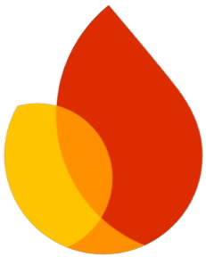

<body>

<h1 align="center" style="font-family:verdana">A Passionate Computer Science Student
</h1>

  

- 🔭  I'm currently diving deep into modern **"Full Stack Web Development"**.

- 🌱 Constantly expanding my skillset with emerging **technologies** and modern **tools**.

- 💬 Open to discussions around **MERN stack** and **core programming concepts**.

- 🚀 Driven to build **innovative solutions** that tackle **real-world challenges**.

- 🧠 Actively exploring cutting-edge **AI trends** and scalable **cloud systems**.

- 🛠️ Grateful to collaborate on **open-source projects** that make a **difference**.

- 📚  Committed to **lifelong learning**, **personal growth**, and **knowledge sharing**.

<h2 align="left">Connect with me:</h2>

<h2 align="left">Languages and Tools:</h2>

  
  
  
  
  
  
  
  <!-- Node.js (local) -->
  
  <!-- Express (local) -->
  
  <!-- Firebase (local) -->
  
  
  
  
  <!-- Canva (local) -->
  
  <!-- MindView (local) -->
  
  
  <!-- Postman -->
  
  <!-- C++ -->
  

</body>
